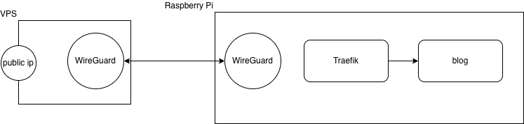

# ブログの構成
date: 2026-04-25

## 構成
このブログはラズパイ上で動いています。
というかラズパイ上で何か動かしたくて、このブログサイトを作りました。


残念ながら僕はパブリックIPを持ち合わせていなかったので、さくらのVPSとラズパイをWireGuardでVPNトンネリングして、VPSからラズパイにトラフィックをルーティングしています。
この構成は[irumarusan](https://x.com/6ftas)に教わりました。いるまるさんありがとう。

ちなみにブログサイトのコードはClaude Codeに書いてもらいました。便利な時代ですね。

## WireGuardの設定
VPS,ラズパイにWireGuardをインストールします。

```sh
sudo apt -y install wireguard
```

VPSにて、/etc/sysctl.confを修正し、Linuxカーネルのパラメータを設定します。
この設定により、VPSはルータとして働き、ラズパイから届いた自分宛じゃないパケットを捨てずにフォワードするようになります。
```conf:/etc/sysctl.conf
net.ipv4.ip_forward=1
```
以下で設定を反映します。
```sh
sudo sysctl -p
```

WireGuardの認証鍵を作成していきます。
```sh
# 秘密鍵を作成
wg genkey | tee server.key
# 秘密鍵を受け取り、公開鍵を作成
cat server.key | wg pubkey | tee server.pub
wg genkey | tee client.key
cat client.key | wg pubkey | tee client.pub
wg genkey | tee preshared.key
```

VPS側の設定ファイル（/etc/wireguard/wg0.conf）を作成します。
```ini
[Interface]
Address = 10.0.0.1/24
# WireGuardのインターフェースが起動した後に実行されるシェルコマンド。ens3から出るパケットの送信元IPをVPSのIPに書き換え(NAT)、ens3に届いたパケットをVPN内のラズパイに転送している。
PostUp = iptables -A FORWARD -i wg0 -j ACCEPT; iptables -t nat -A POSTROUTING -o ens3 -j MASQUERADE; iptables -t nat -A PREROUTING -i ens3 -p tcp --dport 80  -j DNAT --to-destination 10.0.0.2:80; iptables -t nat -A PREROUTING -i ens3 -p tcp --dport 443 -j DNAT --to-destination 10.0.0.2:443; iptables -A FORWARD -i ens3 -o wg0 -p tcp -d 10.0.0.2 --dport 80  -j ACCEPT; iptables -A FORWARD -i ens3 -o wg0 -p tcp -d 10.0.0.2 --dport 443 -j ACCEPT
# インターフェース停止時に実行されるシェルコマンド。PostUpで行った設定を削除している。
PostDown = iptables -D FORWARD -i wg0 -j ACCEPT; iptables -t nat -D POSTROUTING -o ens3 -j MASQUERADE; iptables -t nat -D PREROUTING -i ens3 -p tcp --dport 80  -j DNAT --to-destination 10.0.0.2:80; iptables -t nat -D PREROUTING -i ens3 -p tcp --dport 443 -j DNAT --to-destination 10.0.0.2:443; iptables -D FORWARD -i ens3 -o wg0 -p tcp -d 10.0.0.2 --dport 80  -j ACCEPT; iptables -D FORWARD -i ens3 -o wg0 -p tcp -d 10.0.0.2 --dport 443 -j ACCEPT
ListenPort = 51820
PrivateKey = [server.key]

[Peer]
PublicKey = [client.pub]
PresharedKey = [preshared.key]
AllowedIPs = 10.0.0.2/32
```

ラズパイ側の設定ファイルを作成します。
```
[Interface]
Address = 10.0.0.2/24
PrivateKey = [client.key]

[Peer]
PublicKey = [server.pub]
PresharedKey = [preshared.key]
AllowedIPs = 0.0.0.0/0
Endpoint = [VPSのパブリックIPアドレス]:51820
```

VPS,ラズパイでWireGuardを起動します。
```sh
sudo wg-quick up wg0
sudo systemctl enable wg-quick@wg0
```

これでVPN Tunnelがはられるようになります。
```sh
>ping 10.0.0.1
PING 10.0.0.1 (10.0.0.1) 56(84) bytes of data.
64 bytes from 10.0.0.1: icmp_seq=1 ttl=64 time=9.09 ms
64 bytes from 10.0.0.1: icmp_seq=2 ttl=64 time=5.92 ms
```

## Traefikの設定
L7proxyとしてTraefikを使っています。ブログサイトもTraefikもDockerコンテナで動かしています。
Traefikはコンテナに専用のラベルをつけることで、ルーティングなども設定を行うことができます。
以下のような感じです。

```yml
services:
  traefik:
    image: traefik:v3.6
    container_name: traefik
    command:
      - "--providers.docker=true"
      - "--providers.docker.exposedbydefault=false"
      - "--entrypoints.web.address=:80"
      - "--entrypoints.websecure.address=:443"
      - "--certificatesresolvers.letsencrypt.acme.tlschallenge=true"
      - "--certificatesresolvers.letsencrypt.acme.email=your@email.com"
      - "--certificatesresolvers.letsencrypt.acme.storage=/letsencrypt/acme.json"
    ports:
      - "80:80"
      - "443:443"
      - "8080:8080"
    volumes:
      - "/var/run/docker.sock:/var/run/docker.sock:ro"
      - "./letsencrypt:/letsencrypt"

  blog:
    image: ghcr.io/ryomasumura1201/blog-of-the-ryo:latest
    container_name: blog
    labels:
      - "traefik.enable=true"
      - "traefik.http.routers.blog.rule=Host(`blog.ryo-of-the-ryo.com`)"
      - "traefik.http.routers.blog.entrypoints=websecure"
      - "traefik.http.routers.blog.tls=true"
      - "traefik.http.routers.blog.tls.certresolver=letsencrypt"
      - "traefik.http.services.blog.loadbalancer.server.port=8080"
      # http → https リダイレクト
      - "traefik.http.routers.blog-http.rule=Host(`blog.ryo-of-the-ryo.com`)"
      - "traefik.http.routers.blog-http.entrypoints=web"
      - "traefik.http.routers.blog-http.middlewares=redirect-to-https"
      - "traefik.http.middlewares.redirect-to-https.redirectscheme.scheme=https"
```